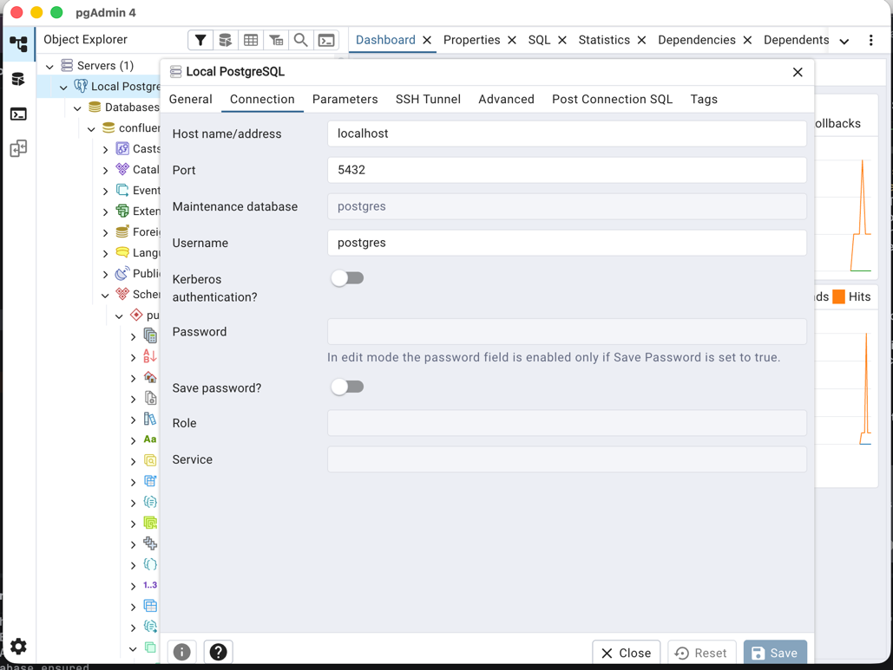

# Confluence Java Chatbot (RAG)
This application will help you build a Confluence chatbot using Retrieval-Augmented Generation (RAG) techniques. 
Using this application, you can ingest Confluence pages, convert them to text, chunk the content, generate embeddings, and store them in PostgreSQL with pgvector. 
You can then perform semantic search for generating context-aware chat responses.

# Technologies used:
- Java 25 with Spring Boot
- Spring AI for Ollama integration
  - Ollama models: `nomic-embed-text:latest` for embeddings and `qwen2.5:latest` for LLM chat responses
  - If needed it can be easily switched to OpenAI API by changing the Spring AI configuration
- PostgreSQL with pgvector extension
- Python Streamlit for UI

# Setup and run
## one time setup
1. Install Java 25 (or adjust `java.version` in `pom.xml`).
2. Install and start local PostgreSQL with pgvector (see instructions below).
3. Generate a Confluence API token (see instructions below).
3. Pull Ollama models:
```zsh
ollama pull nomic-embed-text:latest
ollama pull qwen2.5:latest
```
4. Configure `src/main/resources/application-local.yaml` with your PostgreSQL credentials, Ollama base URL, and Confluence API details.
5. Run the Spring Boot application with the local profile:
```zsh
./mvn spring-boot:run -Dspring-boot.run.profiles=local
cd python-ui
source .venv/bin/activate
streamlit run app.py
```

## Local PostgreSQL + pgvector (Homebrew)

Install and start PostgreSQL:

```zsh
brew install postgresql@17
brew services start postgresql@17
```

Install pgvector:

```zsh
brew install pgvector
```


## Generate Confluence REST API token

1. Sign in to your Confluence instance.
2. Open your profile from right top human icon
3. Click settings => click REST API tokens
4. create new or scroll down to view existing tokens

### Quick validation with `curl`

After setting values, verify access to one page:

```zsh
curl -u "sudha.mohan.panda@yourcomany.nl:<token>" \
"https://confluence.dev.yourcomany.nl/rest/api/content/1373642445?expand=body.storage,version,space"
```


If authentication works, the API returns JSON with page metadata/content.


## API examples

Start ingestion:

```zsh
curl -X POST http://localhost:8080/api/v1/ingestion \
  -H "Content-Type: application/json" \
  -d '{"pageId":"192081535","connectorMode":"REST"}'
```

Check ingestion status:

```zsh
curl http://localhost:8080/api/v1/ingestion/1
```

Get ingestion report (page count + per-page lines + split technique):

```zsh
curl http://localhost:8080/api/v1/ingestion/report/123456
```

Search:

```zsh
curl -X POST http://localhost:8080/api/v1/search \
  -H "Content-Type: application/json" \
  -d '{"query":"Tell me responsibility of hero of the sprint?","topK":5}'
```

Chat (RAG with LLM):

```zsh
curl -X POST http://localhost:8080/api/v1/chat \
  -H "Content-Type: application/json" \
  -d '{"query":"How to rotate API token?","topK":2}'
```

## Real Confluence data test (provided page)

The integration test `RestConfluenceClientRealDataIT` targets the page ID from:
`https://confluence.dev.myABCcompany.nl/spaces/FLA/pages/1373642445/Lena+Extension+Platform`

Set these values in `src/main/resources/application-local.yaml` first:

- `app.confluence.base-url`
- `app.confluence.username`
- `app.confluence.api-token`
- `app.confluence.space-key`

Run only the real-data test:

```zsh
mvn -Dtest=RestConfluenceClientRealDataIT test
```

## Python UI

See `python-ui/README.md`.


